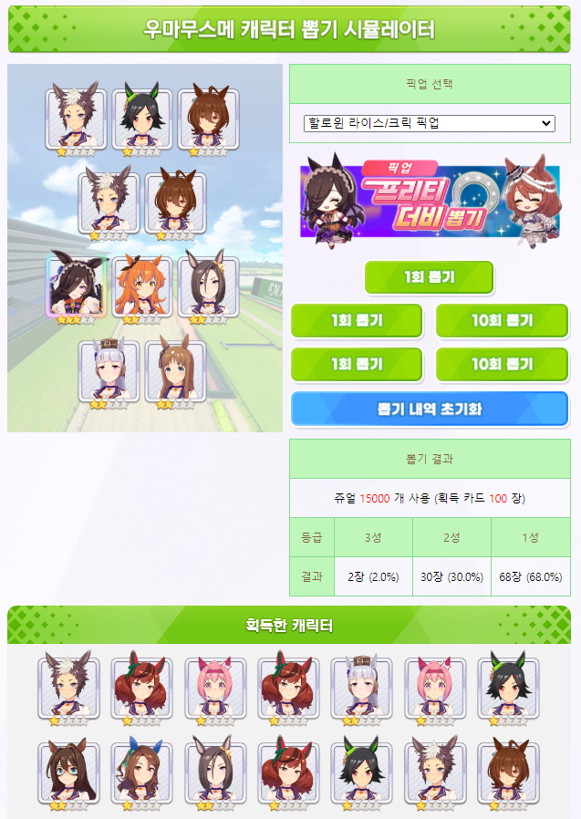

# 우마무스메 캐릭터/서포트 카드 뽑기 시뮬레이터

  
## 소개
모바일 게임 우마무스메 프리티 더비의 가챠 시뮬레이터입니다.  
실제 가챠 화면과 흡사한 시뮬레이터를 만들고 싶다는 생각으로 만들게 되었습니다.  
## 프로젝트 규칙
### 파일명 작명 기준
- 캐릭터 이미지의 경우 출시일 순서대로 `001gacha.png`, `002gacha.png`와 같은 형식으로 작명합니다.  
출시일이 같은 경우 임의로 순서를 지정합니다.  
출시 캐릭터가 1000개 이상이 되면... 그 땐 이름 앞에 0 하나 추가해야지요.
- 배너 이미지의 경우 출시일 순서대로 `banner1.png`와 같은 형식으로 작명합니다.
- 스페셜 가차 배너 이미지는 `banners1.png`와 같이 banner 뒤에 s를 붙입니다.
### 기타
- 가급적 모든 리소스 파일을 프로젝트 내부에서 직접 관리합니다.
- 가급적 불필요한 코드는 지웁니다.
- 한국 (카카오) 서버 데이터를 사용합니다.
- 같은 등급의 픽업 확률은 같으며, 1-10뽑 픽업 확률 또한 같다고 가정합니다.
- 1성(R), 2성(SR), 3성(SSR) 확률은 자연수라고 가정합니다.

## 업데이트 사항
- 2023-01-25: 우마무스메 캐릭터 뽑기 시뮬레이터 초기 구현  
픽업 업데이트  
1일 1회 뽑기/무료 뽑기 기능 추가  
배너, 캐릭터 및 가차 이미지 변경  

## 업데이트 예정 사항
- DB 분리 및 API 처리
- 1회 뽑기 별 위치 및 크기 조정
- 서포트 카드 뽑기 추가
- 우마무스메 퀴즈(Web or Android)
- HTML 배너 element 자바스크립트 코드화

## 참고 자료
- [헝그리앱 : 우마무스메 뽑기 시뮬레이터](http://www.hungryapp.co.kr/bbs/pop/pop_umamusume_select.php) - 시뮬레이터 코드 구조 전반  
- [우마무스메 GameTora](https://gametora.com/umamusume) - 가차 확률
- [카카오게임즈 우마무스메 프리티 더비 FAQ 확률 정보](https://kakaogames.oqupie.com/portals/1576/folders/34814) - 가차 확률
- [우마무스메 인벤 - 캐릭터](https://uma.inven.co.kr/db/chara/) - 캐릭터 타이틀, 이름, 등급 디자인

해당 서비스 개발자는 Cygames, KakaoGames, 우마무스메 개발자와 관계가 없습니다.  
게임에서 얻은 자료의 저작권은 모두 Cygames Inc. 에 속합니다.  